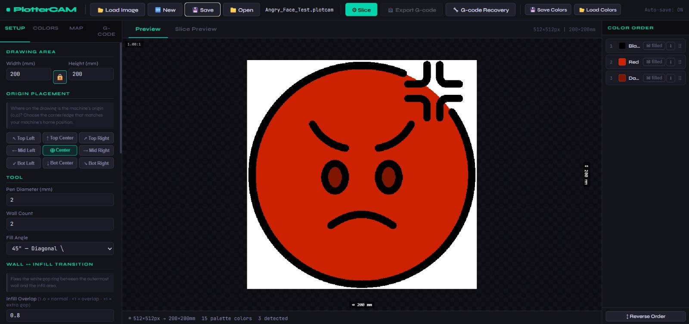
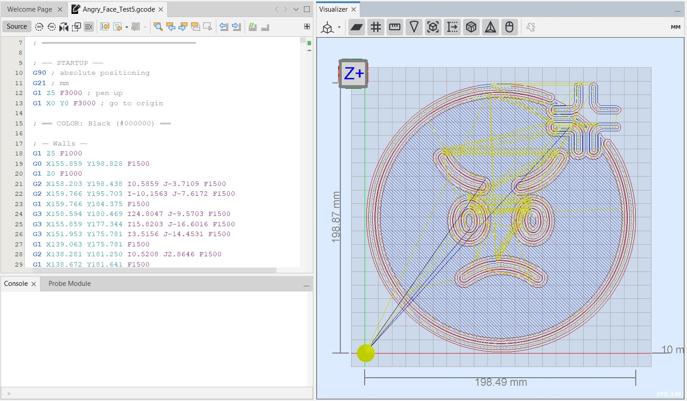
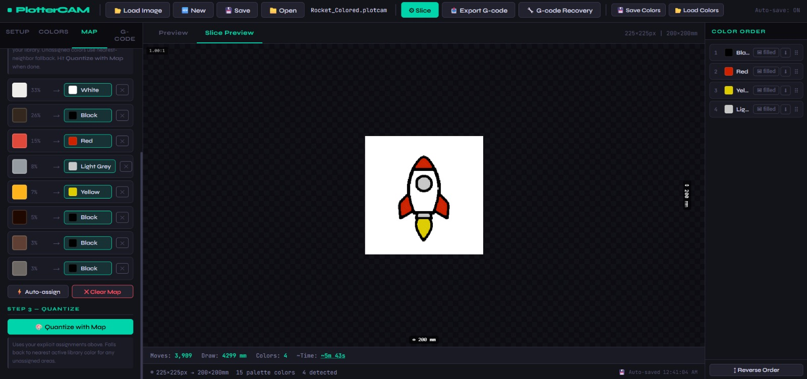
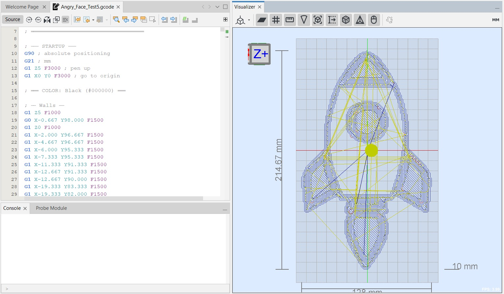

# 🖊 PlotterCAM

**Free, single-file, browser-based CAM software for pen plotters.**  
No installation. No Python environment. No plugins. Just open `index.html` and plot.

🔴 **[Live Demo →](https://Saryps.github.io/PlotterCAM)**

---

## The Problem

Ever tried to find a good pen plotter CAM app that:
- Handles **multiple pen colors** without a painful workflow?
- Generates **smooth arc G-code** instead of thousands of tiny G1 segments?
- Actually gives you an **accurate time estimate**?
- Doesn't require installing half the internet to run?

Most free tools generate pure G1 line floods. Paid tools lock G2/G3 arc output behind paywalls. GRBLPlotter can do it but has a learning curve so steep it has no YouTube tutorials. PlotterCAM does all of it in a single HTML file.

---

## Screenshots

### Multi-color workflow — automatic color detection and pen assignment

### G-code output — real G2/G3 arc commands, not just G1 line floods

### Color map workflow — drag detected colors to your physical pen library

### Complex multi-color toolpath visualization

---

## Features

### 🎨 Color Workflow
- **Automatic color detection** — k-means scanning finds the dominant colors in your image
- **Explicit pen mapping** — drag detected colors to your physical pen library
- **Perceptual quantization** — maps every pixel to your actual pen colors intelligently
- **Per-color control** — toggle outline-only mode, reorder drawing sequence, activate/deactivate colors

### 🔧 G-code Quality
- **G2/G3 arc compression** — fits smooth arcs to curved paths, validated against the original pixel path so shapes never distort. Reduces G-code line count by up to 10x on circular shapes
- **Walls + infill** — proper perimeter walls with configurable count, infill density, fill angle, and wall-to-infill overlap gap elimination
- **Chaikin smoothing** — pre-smoothing before arc fitting for cleaner curves
- **GRBL error 33 prevention** — arc endpoint validation built in

### ⏱ Accurate Time Estimation
- **Acceleration-aware** — models trapezoid/triangle motion profiles using your machine's actual GRBL acceleration settings ($120/$122)
- **Differential segment modeling** — wall arcs and short infill segments are timed separately since infill pays a much heavier acceleration penalty
- Typically within 5% of actual job time

### 🔧 G-code Recovery
- **Resume stopped jobs** after Arduino reset or power loss
- **Positioning replay** — air-traces the path from last G0 to stop point with pen up, so the machine arrives at the exact correct position before putting the pen down. Works correctly for G2/G3 arc paths where I,J offsets depend on current machine position

### 💾 Project Management
- Save/load `.plotcam` project files including image, color assignments, and all settings
- **Auto-save** every 30 seconds to browser storage
- File System Access API — in-place save to the same file without re-prompting
- Settings persist across sessions including acceleration parameters

---

## How to Use

1. **Load Image** — drag and drop or click to load any PNG/JPG
2. **Colors tab** — scan image colors, assign each detected color to a pen in your library
3. **Quantize with Map** — applies your pen assignments to the image
4. **Slice** — generates toolpaths (walls + infill) for each color layer
5. **Export G-code** — download and send to your machine

---

## Technical Highlights

- **Arc fitting with original-path validation** — RDP simplification finds arc candidates fast, then every candidate is validated against the full-resolution original pixel path at 0.3mm tolerance. This prevents a subtle bug where the simplified path fits a circle but the discarded original points are 1-2mm off the arc
- **Two-stage arc search** — loose tolerance (0.5mm) on RDP points for candidate finding, strict tolerance (0.3mm) on all original points for validation
- **Physics-based time estimation** — trapezoid profile for long moves, triangle profile for short moves that never reach full speed. Infill modeled separately from walls because short-segment infill typically runs 1.5-2x slower than wall arcs due to constant acceleration overhead
- Single HTML file, zero dependencies, zero build step

---

## Machine Compatibility

Designed for **GRBL-based machines with a proper Z axis** for pen up/down — DIY CNCs, converted routers, or any machine where pen lift is controlled by a Z motor using `G1 Z` moves.

> ⚠️ **Servo pen lift machines** (AxiDraw, most cheap pen plotters) are **not currently supported**. These machines use `M3`/`M5` or custom servo commands for pen lift rather than Z axis moves. Support may be added in a future version.

Tested on a custom DIY CNC with Nema 23 motors, DM556 drivers, and Arduino Uno R3.  
G2/G3 arc output requires GRBL 0.9+ with arc support enabled.  
Set `$12` (arc tolerance) in GRBL to match your pen diameter for best results.

---

## License

MIT — free to use, modify, and share.
